# Autonomous AI Content Engine

> **Portfolio Project:** AI & Data Engineering Track
> **Domain:** Generative AI / Automation / API Orchestration
> **Status:** Production-Ready (Local)

### System Architecture

The automation pipeline is designed for real-time data ingestion, multi-modal LLM processing, and secure programmatic publishing via REST APIs.

```mermaid
flowchart LR
  classDef extract fill:#0f172a,stroke:#334155,color:#fff,stroke-width:2px
  classDef brain fill:#312e81,stroke:#6366f1,color:#fff,stroke-width:2px
  classDef create fill:#1e293b,stroke:#0891b2,color:#fff,stroke-width:2px
  classDef publish fill:#064e3b,stroke:#10b981,color:#fff,stroke-width:2px
  classDef schedule fill:#7f1d1d,stroke:#ef4444,color:#fff,stroke-width:2px

  subgraph Scheduler [Orchestration]
    Z(Python Schedule)
  end

  subgraph Ingest [Data Ingestion]
    A(Selenium Web Scraper)
  end

  subgraph AI [AI Processing]
    B(Gemini 2.5 Flash)
  end

  subgraph Image [Content Gen]
    C(Stable Diffusion XL)
  end

  subgraph Deploy [Publishing]
    D(LinkedIn API v2)
  end

  Z -->|Triggers 06:00 & 21:00| Ingest
  Ingest -->|Raw Feed Text| AI
  AI -->|Image Prompt| Image
  AI -->|Post Caption| Deploy
  Image -->|Generated PNG| Deploy
  Deploy -->|HTTP POST| Live(Live Feed)

  class Z schedule
  class A extract
  class B brain
  class C create
  class D,Live publish
```


## Executive Summary
The **Autonomous AI Content Engine** is an end-to-end Machine Learning and automation pipeline designed to maintain a consistent, high-quality professional presence on LinkedIn without manual intervention. 

In the modern tech industry, maintaining an active portfolio is critical, but manually curating and publishing content can consume upwards of **10 to 15 hours per month**. This project leverages web scraping and multi-modal Generative AI to autonomously extract trending industry topics, synthesize insightful thought-leadership posts, generate accompanying visuals, and publish them twice daily.

## Key Features
* **Dynamic Data Ingestion:** Uses a headless browser approach to securely extract unstructured text from dynamic professional feeds, bypassing complex UI structures.
* **Intelligent Content Generation:** Leverages Google's **Gemini 2.5 Flash** to act as a data-centric ghostwriter, transforming raw feed trends into cohesive, context-aware posts.
* **Automated Image Creation:** Connects to the Hugging Face Inference API (**Stable Diffusion XL**) to dynamically generate high-quality, 8k-resolution visual assets.
* **Secure API Publishing:** Utilizes the official LinkedIn v2 API and **OAuth 2.0** to securely register media assets and autonomously publish multi-modal content payloads.

## Tech Stack
* **Language:** Python 3.14
* **Data Extraction:** Selenium WebDriver
* **LLM / Text Generation:** `google-genai` (Gemini 2.5 Flash)
* **Image Generation:** `huggingface_hub` (Stability AI)
* **API Integration:** `requests` (LinkedIn UGC Posts & Asset Registration)
* **Environment:** VS Code, Windows Task Scheduler / Python `schedule`

## API & Integration Information
Unlike static datasets, this project relies on real-time data flow between three major external APIs:
* **Google AI Studio:** Provides access to the Gemini 2.5 Flash model for natural language understanding and generation.
* **Hugging Face Hub:** Provides high-speed routing to top-tier open-source image generation models.
* **LinkedIn Developer Portal:** Utilizes a custom Developer App with `openid`, `profile`, and `w_member_social` scopes for authorized posting via URN targeting.

## Installation & Usage

### 1. Prerequisites
Ensure you have Python installed. It is highly recommended to use a virtual environment to manage API dependencies.

```bash
# Clone the repository
git clone [https://github.com/yourusername/autonomous-ai-content-engine.git](https://github.com/yourusername/autonomous-ai-content-engine.git)
cd autonomous-ai-content-engine

# Create virtual environment
python -m venv venv
source venv/bin/activate  # On Windows use: venv\Scripts\activate

# Install required packages
pip install selenium python-dotenv google-genai requests huggingface_hub pillow schedule
```
### 2. Environment Setup
Create a .env file in the root directory. Ensure this file is added to your .gitignore to prevent leaking API keys.
```bash
LINKEDIN_USER=your_email@example.com
LINKEDIN_PASS=your_password
GEMINI_API_KEY=your_google_ai_studio_key
HUGGINGFACE_API_KEY=your_huggingface_read_token
LINKEDIN_ACCESS_TOKEN=your_60_day_oauth_token
```
### 3. Execution
To run the automated pipeline on its standard schedule (06:00 and 21:00):

```bash
python main.py
```
## Project Snapshots


